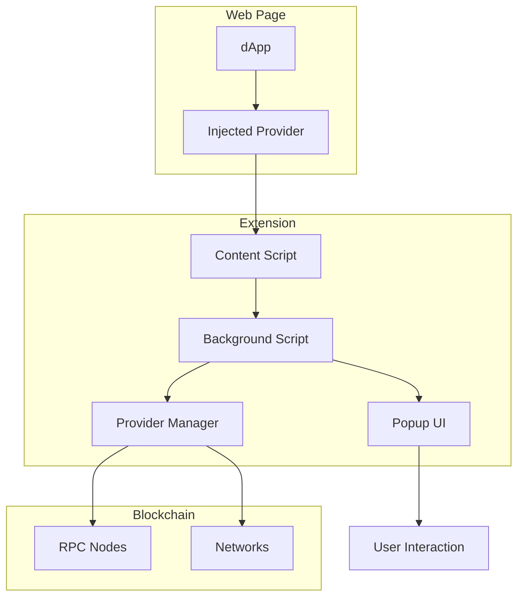

# Purro EVM Provider Documentation

Chào mừng đến với tài liệu của Purro EVM Provider - implementation đầy đủ của EIP-1193 và EIP-6963 cho Purro Wallet.

## 📚 Table of Contents

### 🎯 Core Documentation
- [**Communication Methods**](./evm-provider-communication.md) - Chi tiết về các cách dApps giao tiếp với provider
- [**Architecture**](./evm-provider-architecture.md) - Kiến trúc tổng thể và design patterns
- [**Main README**](../EVM_PROVIDER_README.md) - Hướng dẫn sử dụng tổng quan

### 🚀 Quick Start

#### 1. EIP-6963 Provider Discovery (Recommended)
```javascript
// Listen for provider announcements
const providers = [];
window.addEventListener('eip6963:announceProvider', (event) => {
  providers.push(event.detail);
});

// Request providers
window.dispatchEvent(new CustomEvent('eip6963:requestProvider'));

// Find Purro Wallet
const purroProvider = providers.find(p => p.info.rdns === 'com.purro.wallet');
if (purroProvider) {
  const provider = purroProvider.provider;
  const accounts = await provider.request({ method: 'eth_requestAccounts' });
}
```

#### 2. Legacy Detection
```javascript
// Check window.ethereum
if (window.ethereum?.info?.rdns === 'com.purro.wallet') {
  const provider = window.ethereum;
} else if (window.purro) {
  const provider = window.purro;
}
```

## 🎭 Communication Methods Overview

Purro EVM Provider hỗ trợ **4 cách chính** để dApps giao tiếp:

| Method        | Standard     | Status            | Use Case                 |
| ------------- | ------------ | ----------------- | ------------------------ |
| `request()`   | EIP-1193     | ✅ **Recommended** | Modern async/await API   |
| `send()`      | Legacy       | ✅ Supported       | Simplified legacy method |
| `sendAsync()` | Legacy       | ✅ Supported       | Callback-based legacy    |
| `enable()`    | Pre-EIP-1193 | ✅ Supported       | Very old connection      |

### Example Usage

```javascript
// Modern EIP-1193 (Recommended)
const accounts = await provider.request({ method: 'eth_requestAccounts' });
const txHash = await provider.request({
  method: 'eth_sendTransaction',
  params: [{ from: accounts[0], to: '0x...', value: '0x...' }]
});

// Legacy methods
const chainId = await provider.send('eth_chainId');
const balance = await provider.send('eth_getBalance', [address, 'latest']);

// Very old method
const accounts = await provider.enable();
```

## 🏗️ Architecture Overview



### Core Components

1. **EVM Provider** (`evm-provider.ts`) - Core implementation
2. **Content Script** (`content-script.ts`) - Web page injection
3. **Provider Manager** (`provider-manager.ts`) - Multi-chain management
4. **Type System** (`evm-provider.ts`) - Full TypeScript support

## 🔧 Supported RPC Methods

### Account Management
- `eth_requestAccounts` - Request account access
- `eth_accounts` - Get connected accounts
- `wallet_getPermissions` - Get current permissions
- `wallet_requestPermissions` - Request new permissions

### Chain Information
- `eth_chainId` - Get current chain ID
- `net_version` - Get network version
- `wallet_addEthereumChain` - Add new chain
- `wallet_switchEthereumChain` - Switch to different chain

### Transactions
- `eth_sendTransaction` - Send transaction
- `eth_getBalance` - Get account balance

### Signing
- `personal_sign` - Sign message
- `eth_signTypedData_v4` - Sign typed data (EIP-712)

## 🎭 Event System

```javascript
// Listen for important events
provider.on('accountsChanged', (accounts) => {
  console.log('Accounts changed:', accounts);
});

provider.on('chainChanged', (chainId) => {
  console.log('Chain changed to:', chainId);
  window.location.reload(); // Recommended
});

provider.on('connect', ({ chainId }) => {
  console.log('Connected to chain:', chainId);
});

provider.on('disconnect', (error) => {
  console.log('Disconnected:', error);
});
```

## 🛡️ Security Features

### Origin Validation
- Tất cả requests đều include origin
- Background script validate domain permissions
- User có thể revoke permissions per-site

### User Confirmation
- **Account Access**: User approval required
- **Transactions**: Always show confirmation popup
- **Message Signing**: User must approve each signature
- **Chain Changes**: User confirmation for new chains

### Error Handling
```javascript
try {
  const result = await provider.request({ method: 'eth_requestAccounts' });
} catch (error) {
  switch (error.code) {
    case 4001: // User rejected
      console.log('User rejected the request');
      break;
    case 4100: // Unauthorized
      console.log('Unauthorized - wallet not connected');
      break;
    case 4200: // Unsupported method
      console.log('Method not supported');
      break;
    default:
      console.error('Unexpected error:', error);
  }
}
```

## 🧪 Testing & Development

### Run Tests
```javascript
// In browser console
window.purroDemo.runAllDemos();

// Or programmatically
import { testProvider } from '../utils/provider-test';
const provider = new PurroEVMProvider();
await testProvider(provider);
```

### Debug Interface
```javascript
// Available in browser console
window.purroDebug.provider       // Provider instance
window.purroDebug.testProvider() // Run tests
window.purroDebug.getState()     // Get current state
```

## 🌐 Multi-Chain Support

### Default Supported Chains
- **Ethereum Mainnet** (`0x1`)
- **Polygon Mainnet** (`0x89`)
- **Arbitrum One** (`0xa4b1`)

### Add Custom Chain
```javascript
await provider.request({
  method: 'wallet_addEthereumChain',
  params: [{
    chainId: '0x89',
    chainName: 'Polygon Mainnet',
    nativeCurrency: {
      name: 'MATIC',
      symbol: 'MATIC',
      decimals: 18
    },
    rpcUrls: ['https://polygon-rpc.com/'],
    blockExplorerUrls: ['https://polygonscan.com']
  }]
});
```

## 📊 Standards Compliance

- ✅ **EIP-1193**: Ethereum Provider JavaScript API
- ✅ **EIP-6963**: Multi Injected Provider Discovery
- ✅ **EIP-712**: Typed structured data hashing and signing
- ✅ **EIP-3326**: Wallet Switch Ethereum Chain RPC Method

## 🔄 Migration Guide

### From MetaMask/Other Wallets
```javascript
// Old MetaMask way
if (typeof window.ethereum !== 'undefined') {
  const accounts = await window.ethereum.request({ method: 'eth_requestAccounts' });
}

// Purro way (EIP-6963)
const providers = [];
window.addEventListener('eip6963:announceProvider', (event) => {
  providers.push(event.detail);
});
window.dispatchEvent(new CustomEvent('eip6963:requestProvider'));

const purroProvider = providers.find(p => p.info.rdns === 'com.purro.wallet');
if (purroProvider) {
  const accounts = await purroProvider.provider.request({ method: 'eth_requestAccounts' });
}
```

### Legacy Support
```javascript
// Support both old and new
function getProvider() {
  // Try EIP-6963 first
  const providers = getEIP6963Providers();
  const purro = providers.find(p => p.info.rdns === 'com.purro.wallet');
  if (purro) return purro.provider;
  
  // Fallback to legacy
  if (window.purro) return window.purro;
  if (window.ethereum?.info?.rdns === 'com.purro.wallet') return window.ethereum;
  
  throw new Error('Purro Wallet not found');
}
```

## 🚀 Performance Tips

### 1. Use Modern Methods
```javascript
// ✅ Good - Modern EIP-1193
const accounts = await provider.request({ method: 'eth_requestAccounts' });

// ❌ Avoid - Very old method
const accounts = await provider.enable();
```

### 2. Handle Events Properly
```javascript
// ✅ Good - Clean up listeners
const handler = (accounts) => console.log(accounts);
provider.on('accountsChanged', handler);

// When component unmounts
provider.removeListener('accountsChanged', handler);
```

### 3. Cache Provider Instance
```javascript
// ✅ Good - Cache provider
let cachedProvider = null;
function getProvider() {
  if (!cachedProvider) {
    cachedProvider = findPurroProvider();
  }
  return cachedProvider;
}
```

## 🔍 Troubleshooting

### Common Issues

#### Provider Not Found
```javascript
// Check if extension is installed
if (!window.purro && !window.ethereum?.info?.rdns?.includes('purro')) {
  console.log('Purro Wallet not installed');
  // Show install prompt
}
```

#### Connection Rejected
```javascript
try {
  await provider.request({ method: 'eth_requestAccounts' });
} catch (error) {
  if (error.code === 4001) {
    console.log('User rejected connection');
    // Show retry button
  }
}
```

#### Chain Not Supported
```javascript
try {
  await provider.request({
    method: 'wallet_switchEthereumChain',
    params: [{ chainId: '0x89' }]
  });
} catch (error) {
  if (error.code === 4902) {
    // Chain not added, try adding it first
    await provider.request({
      method: 'wallet_addEthereumChain',
      params: [polygonChainConfig]
    });
  }
}
```

## 📞 Support & Contributing

### Getting Help
- Check [Communication Methods](./evm-provider-communication.md) for API details
- Review [Architecture](./evm-provider-architecture.md) for technical details
- Run built-in tests: `window.purroDemo.runAllDemos()`

### Contributing
1. Fork repository
2. Create feature branch
3. Add tests for new functionality
4. Submit pull request

### Reporting Issues
- Include browser and extension version
- Provide code snippet that reproduces issue
- Check console for error messages
- Test with demo: `window.purroDemo.runAllDemos()`

---

🐱 **Purro Wallet** - Making Web3 accessible and secure for everyone! 