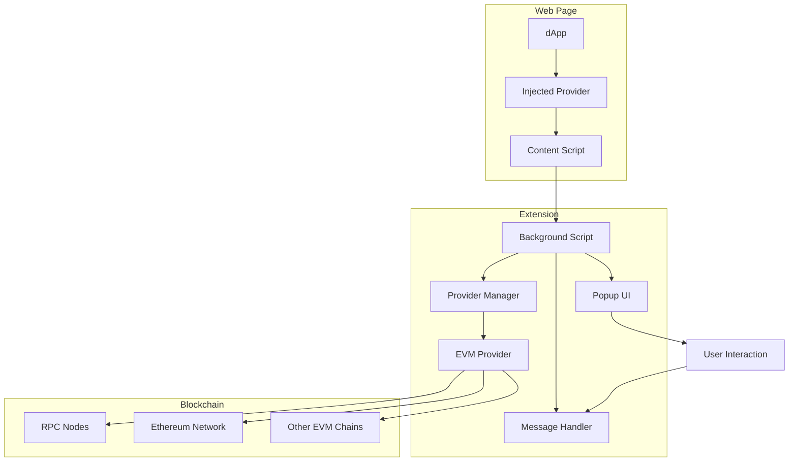
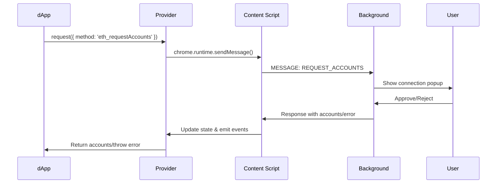
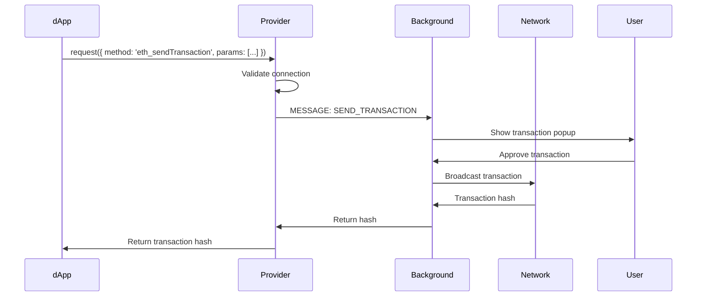
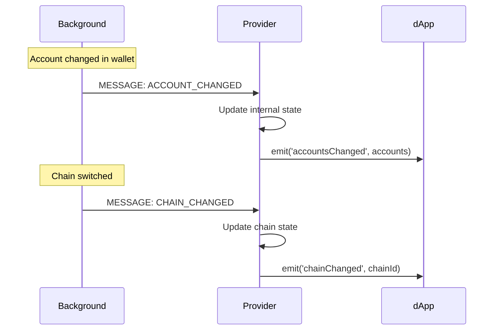

# EVM Provider Architecture

Tài liệu này mô tả kiến trúc tổng thể của Purro EVM Provider và cách các components tương tác với nhau.

## 🏗️ System Overview



## 📁 Directory Structure

```
src/
├── types/
│   └── evm-provider.ts          # Type definitions
├── background/
│   ├── providers/
│   │   ├── evm-provider.ts      # Core provider implementation
│   │   ├── content-script.ts    # Web page injection
│   │   ├── provider-manager.ts  # Multi-provider management
│   │   └── demo.ts             # Usage examples
│   ├── utils/
│   │   └── provider-test.ts     # Testing utilities
│   └── background.ts            # Main background script
└── docs/
    ├── evm-provider-communication.md
    └── evm-provider-architecture.md
```

## 🎯 Core Components

### 1. EVM Provider (`evm-provider.ts`)

**Trách nhiệm chính:**
- Implement EIP-1193 và EIP-6963 standards
- Xử lý tất cả RPC methods
- Quản lý connection state
- Event system cho dApps
- Error handling với proper codes

**Key Features:**
```typescript
export class PurroEVMProvider implements EIP1193Provider {
  // EIP-1193 main method
  async request(args: RequestArguments): Promise<unknown>
  
  // Event management
  on(eventName: string, listener: Function): this
  removeListener(eventName: string, listener: Function): this
  
  // Legacy compatibility
  async enable(): Promise<string[]>
  async send(method: string, params?: any[]): Promise<any>
  sendAsync(payload: JsonRpcRequest, callback: Function): void
  
  // EIP-6963 discovery
  getProviderDetail(): EIP6963ProviderDetail
}
```

### 2. Content Script (`content-script.ts`)

**Trách nhiệm chính:**
- Inject provider vào web pages
- EIP-6963 provider announcement
- Handle page navigation events
- Bridge communication với background script

**Implementation:**
```typescript
// Create provider instance
const purroProvider = new PurroEVMProvider();

// EIP-6963 announcement
function announceProvider() {
  const event = new CustomEvent('eip6963:announceProvider', {
    detail: purroProvider.getProviderDetail()
  });
  window.dispatchEvent(event);
}

// Legacy injection
if (!window.ethereum) {
  window.ethereum = purroProvider;
}
window.purro = purroProvider;
```

### 3. Provider Manager (`provider-manager.ts`)

**Trách nhiệm chính:**
- Quản lý multiple blockchain providers
- Centralized provider access
- Event coordination
- State synchronization

**Architecture:**
```typescript
export class PurroProviderManager {
  private providers: Map<ChainType, any> = new Map();
  
  getProvider(chainType: ChainType): any
  isProviderSupported(chainType: ChainType): boolean
  handleProviderEvent(chainType: ChainType, event: string, data: any)
}
```

### 4. Background Script Integration

**Message Flow:**
```typescript
// Provider -> Background
chrome.runtime.sendMessage({
  type: 'REQUEST_ACCOUNTS',
  origin: window.location.origin
});

// Background -> Provider
chrome.runtime.onMessage.addListener((message, sender, sendResponse) => {
  switch (message.type) {
    case 'ACCOUNT_CHANGED':
      this.handleAccountsChanged(message.accounts);
      break;
    case 'CHAIN_CHANGED':
      this.handleChainChanged(message.chainId);
      break;
  }
});
```

## 🔄 Communication Flow

### 1. dApp Connection Flow



### 2. Transaction Flow



### 3. Event Propagation



## 🎭 State Management

### Provider State
```typescript
interface WalletState {
  isConnected: boolean;
  accounts: string[];
  chainId: string;
  networkVersion: string;
}

// Internal state tracking
private state: WalletState = {
  isConnected: false,
  accounts: [],
  chainId: '0x1',
  networkVersion: '1'
};
```

### Chain Information
```typescript
private supportedChains: Map<string, ChainInfo> = new Map([
  ['0x1', {
    chainId: '0x1',
    chainName: 'Ethereum Mainnet',
    nativeCurrency: { name: 'Ether', symbol: 'ETH', decimals: 18 },
    rpcUrls: ['https://mainnet.infura.io/v3/'],
    blockExplorerUrls: ['https://etherscan.io']
  }],
  // ... more chains
]);
```

### Event State Synchronization
```typescript
// Handle state changes from background
private handleAccountsChanged(accounts: string[]) {
  this.state.accounts = accounts;
  this.state.isConnected = accounts.length > 0;
  this.emit('accountsChanged', accounts);
}

private handleChainChanged(chainId: string) {
  this.state.chainId = chainId;
  this.state.networkVersion = parseInt(chainId, 16).toString();
  this.emit('chainChanged', chainId);
}
```

## 🔐 Security Architecture

### 1. Origin Validation
```typescript
// Always include origin in requests
const response = await chrome.runtime.sendMessage({
  type: 'REQUEST_ACCOUNTS',
  origin: window.location.origin
});
```

### 2. Permission System
```typescript
// Check permissions before operations
if (!this.state.isConnected) {
  throw new ProviderError(ProviderErrorCode.UNAUTHORIZED, 'Wallet not connected');
}
```

### 3. User Confirmation Requirements
- **Account Access**: Requires user approval
- **Transactions**: Always show confirmation popup
- **Message Signing**: User must approve each signature
- **Chain Changes**: User confirmation for new chains

### 4. Error Handling
```typescript
// Standardized error responses
export enum ProviderErrorCode {
  USER_REJECTED = 4001,
  UNAUTHORIZED = 4100,
  UNSUPPORTED_METHOD = 4200,
  DISCONNECTED = 4900,
  CHAIN_DISCONNECTED = 4901,
  INVALID_PARAMS = -32602,
  INTERNAL_ERROR = -32603
}
```

## 🚀 Performance Considerations

### 1. Event Debouncing
```typescript
// Prevent spam events
let accountChangeTimeout: NodeJS.Timeout;

private handleAccountsChanged(accounts: string[]) {
  if (accountChangeTimeout) {
    clearTimeout(accountChangeTimeout);
  }
  
  accountChangeTimeout = setTimeout(() => {
    this.emit('accountsChanged', accounts);
  }, 100);
}
```

### 2. Lazy Loading
```typescript
// Load chains on demand
private async getChainInfo(chainId: string): Promise<ChainInfo> {
  if (!this.supportedChains.has(chainId)) {
    await this.loadChainInfo(chainId);
  }
  return this.supportedChains.get(chainId)!;
}
```

### 3. Request Batching
```typescript
// Batch similar requests
private requestQueue: RequestArguments[] = [];
private processingQueue = false;

async request(args: RequestArguments): Promise<unknown> {
  this.requestQueue.push(args);
  
  if (!this.processingQueue) {
    return this.processRequestQueue();
  }
}
```

## 🧪 Testing Architecture

### 1. Unit Tests
```typescript
// Test individual methods
export class ProviderTester {
  async testBasicFunctionality(): Promise<boolean>
  testEIP6963Discovery(): boolean
  testEventSystem(): boolean
  async testErrorHandling(): Promise<boolean>
  async testLegacyMethods(): Promise<boolean>
}
```

### 2. Integration Tests
```typescript
// Test full flow
async function testFullConnectionFlow() {
  const provider = new PurroEVMProvider();
  
  // Test discovery
  const detail = provider.getProviderDetail();
  assert(detail.info.rdns === 'com.purro.wallet');
  
  // Test connection
  const accounts = await provider.request({ method: 'eth_requestAccounts' });
  assert(Array.isArray(accounts));
}
```

### 3. Mock System
```typescript
// Mock background responses
export function createMockResponse(result: any, error?: string) {
  return {
    result: error ? undefined : result,
    error: error || undefined
  };
}
```

## 🔧 Extension Points

### 1. Adding New RPC Methods
```typescript
// In request() method switch statement
case 'custom_method':
  return await this.handleCustomMethod(paramsArray[0]);
```

### 2. Adding New Chains
```typescript
// Extend supported chains
this.supportedChains.set('0xa4b1', {
  chainId: '0xa4b1',
  chainName: 'Arbitrum One',
  // ... chain config
});
```

### 3. Custom Event Types
```typescript
// Extend ProviderEventMap
export type ProviderEventMap = {
  connect: { chainId: string };
  disconnect: { code: number; message: string };
  accountsChanged: string[];
  chainChanged: string;
  // Add custom events
  customEvent: { data: any };
};
```

## 📊 Monitoring & Debugging

### 1. Logging System
```typescript
// Provider logs all operations
console.log('🐱 Purro Wallet provider injected successfully');
console.log('Provider available at:', {
  'window.ethereum': !!window.ethereum,
  'window.purro': !!window.purro,
  'EIP-6963': 'Supported'
});
```

### 2. Debug Interface
```typescript
// Expose debug methods
if (typeof window !== 'undefined') {
  (window as any).purroDebug = {
    provider: purroProvider,
    testProvider: () => testProvider(purroProvider),
    getState: () => purroProvider.state
  };
}
```

### 3. Error Tracking
```typescript
// Track errors for debugging
private logError(method: string, error: any) {
  console.error(`[Purro Provider] ${method} failed:`, error);
  
  // Send to analytics if needed
  if (this.enableAnalytics) {
    this.sendErrorReport(method, error);
  }
}
```

## 🔄 Future Extensibility

### 1. Multi-Chain Support
```typescript
// Architecture ready for multiple chains
interface ChainProvider {
  chainType: ChainType;
  provider: any;
  isSupported(method: string): boolean;
}
```

### 2. Plugin System
```typescript
// Plugin interface for extensions
interface ProviderPlugin {
  name: string;
  methods: string[];
  handler(method: string, params: any[]): Promise<any>;
}
```

### 3. Advanced Features
- Hardware wallet integration
- Multi-signature support
- Custom RPC endpoints
- Advanced permission management
- Cross-chain operations

Architecture này đảm bảo tính mở rộng, bảo mật và hiệu suất cao cho Purro EVM Provider! 